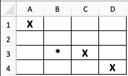

Programming Concepts Workshop | https://github.com/nuitrcs/programming-concepts


\pagenumbering{gobble}

# Conditions

**[ True or False ]** When using variables with boolean values in a conditional statement, you should explicitly compare them to True or False to determine their value.

The operator to test for equality is _______.

Is the following **[ True or False ]**; `(TRUE and FALSE) or (not FALSE and TRUE)`


# Flow Control

If statements determine what to do based on a condition that evaluates to **[ a single/multiple ]** True or False value(s).



Where will the `>` in cell B3 of Figure 1 above end up if you execute the following statements?  The point of the `>` indicates the direction that is "forward" facing.

```
rotate left
if space ahead of you is occupied
  move one space to your left
  rotate right
else
  move one space forward
move one space forward
if you are in column B
  move one space to your left
else if you are facing up
  move one space forward
else 
  move one space backwards
```

# For Loops

Loops are used to ____________ the same code for ____________ values.

The following code will print _____ numbers.

```
x = [1, 4, 3, 6, 7, 2]
for i in x
	if i < 5
		print i
``` 
